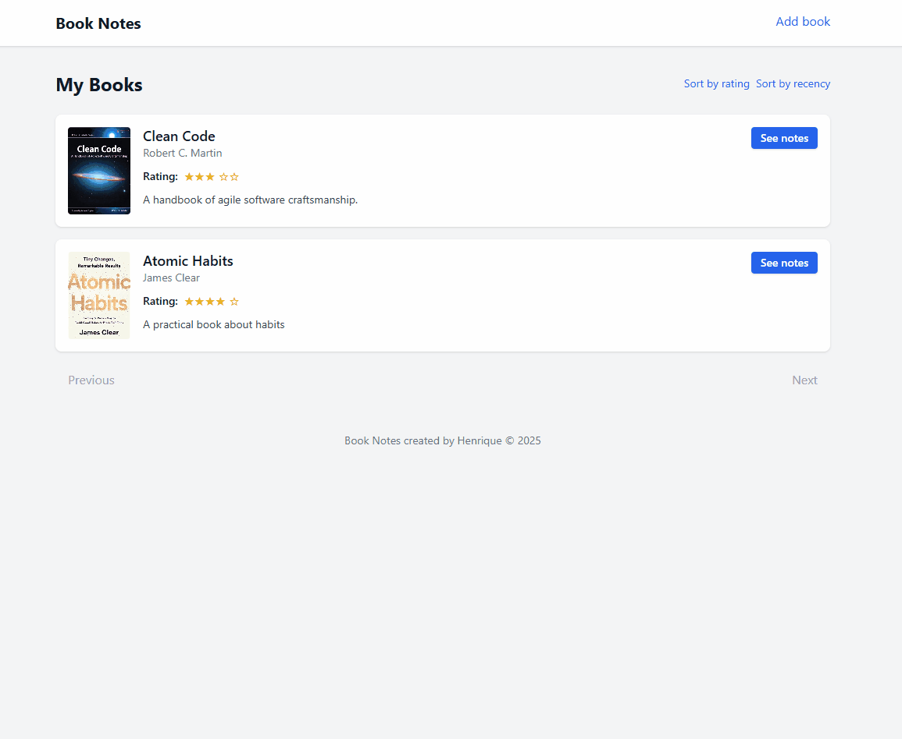

# Booknote App


A simple web application to manage and take notes on books.

## Features

- Add, update, and delete books  
- Add and update notes per book  
- Automatic fetching of book covers via ISBN  
- Sort books by rating or recency  
- Pagination for easy browsing  

## Tech Stack

- **Backend:** Node.js, Express.js  
- **Frontend:** EJS, Tailwind CSS  
- **Database:** PostgreSQL  
- **HTTP Client:** Axios  

## Installation

1. Clone the repository:
```bash
git clone https://github.com/jshenriq/booknotes-app.git
cd book-notes
```

2. Install dependencies:
```bash
npm install
```

3. Create a `.env` file:
```env
DB_USER=your_postgres_user
DB_PASSWORD=your_postgres_password
DB_HOST=localhost
DB_PORT=5432
DB_NAME=your_database_name
```

4. Create the database and the `books` table using `schema.sql` (in the `db` folder) via psql or pgAdmin.

5. Start the server:
```bash
node index.js
```

## Demo



## Usage

- **Add book:** `/books/new`
- **View notes:** Click **See notes**
- **Edit notes & rating:** Use the form on the notes page
- **Delete notes / book:** Use the available action buttons
- **Sorting:** Click **Sort by rating** or **Sort by recency**
- **Pagination:** 10 books per page using **Previous** / **Next**

## Notes on Implementation

- Pagination uses `LIMIT` and `OFFSET`, fetching `limit + 1` rows to detect the next page
- Sorting is handled via SQL `ORDER BY` based on query parameters
- Providing an ISBN triggers cover fetching from the Open Library API
- All database queries are parameterized to prevent SQL injection

## License

This project is licensed under the MIT License. 